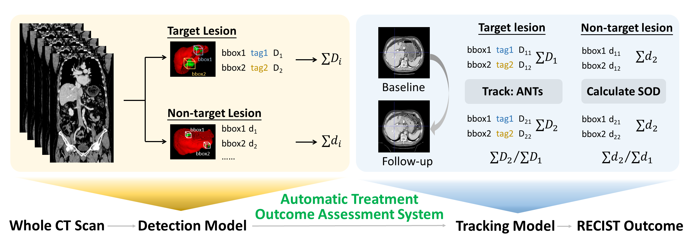

# detect-then-track
This is the GitHub Repository providing an example code base for "Deep Learning-based Detect-then-track Pipeline for Treatment Outcome Assessments in Immunotherapy-treated Liver Cancer".

## Get started
The detect-then-track pipeline can be devided into two main parts, lesion detection and lesion tracking. The following subsection will provide a demo code for each step.

### Lesion detection
In lesion detection step, [nnDetection](https://github.com/MIC-DKFZ/nnDetection) were used. nnDetection is based on Retina-Unet. Weakly supervision of masks are needed. In this work, a 2D slice with the largest tumor diameter in axial view was selected from the 3D scan for each liver lesion, and annotated the two endpoints of the diameter. The annotated diameter was used to generate the pseudo-mask.

Run `python detect_prep/pseudomask.py` for pseudo-mask generation. Inputs are defined below.

|  input  | description |
| ------------------- | ------------- |
| `img_base`  | base directory for the input CT scans |
| `save_base` | saving directory for the generated pseudo-mask |
| `csv_path`  | a xml file of annotated two endpoints of the diameter |

For comparative studies, Retina-Net and Faster-RCNN were adopted.

### Baseline-follow-up registration

Advanced Normalization Tools [(ANTs)](https://github.com/ANTsX/ANTsPy) were adopted. Besides, we compared the registration performances under three scenarios: without registration, non-deformable rigid registration, and deformable [DEEDS](https://github.com/mattiaspaul/deedsBCV) registration. 

### Lesion Tracking
Lesion tracking needs three main steps:
1. Read the pickle files that contains the coordinate and probability information predicted by nnDetection, and calculate the diameter for each lesion.

Run `python tracking/python convert_pkl_box.py`.

|  input  | description |
| ------------------- | ------------- |
| `status`  | validation (val) or test (ts) |
| `pred_path` | base directory of pkl files predicted by nnDetection |

2. Give each lesion a unique id (i.e., from 1 to N, N is the total number of lesions). This id is used to track the registered lesion.

Run `python tracking/pred_ants_prep.py`.

|  input  | description |
| ------------------- | ------------- |
| `status`  | validation (val) or test (ts) |
| `image_path` | base directory for the input CT scans |
| `annot` | the csv file generated by step 1 |
| `save_mask_path` | saving directory for the generated id |

3. Do ANTs registration. The displacement field is generated by the fix image (baseline) and the moving image (follow-up). The generated id file (with the format of .nii.gz) was inputted as a mask to apply the displacement field.

NOTE: As deformable registration would change the diameter, here we used the original (no registered) diameter and the transformed (registered) center point as the follow-up lesion information.

Run `python tracking/ants_loc_diam.py`.

|  input  | description |
| ------------------- | ------------- |
| `status`  | validation (val) or test (ts) |
| `before_register` |  the csv file generated by step 1 |
| `mask_path` | the transformed mask of step 2 |
| `image_path` | base directory for the transformed CT scans |
| `baseline_path` | the original predicted baseline (baseline is the fixed one, so it would not be transformed by ANTs) |

After the three steps, we can get a csv file that contains the (transformed) center point and the diameter information of both baseline and follow-up scans.

For tracking accuracy, run `python tracking/tracking_acc.py`.

### Overall RECIST accuracy
After the detection and the tracking steps, we calculated the sum of the diameter of both target lesions and non-target lesions and the RECIST outcome in a comprehensive manner as follows:

1. In the baseline assessment, lesions with a diameter greater than 10 mm are considered as target lesions. If there exist more than two target lesions, the two lesions with the largest diameters will be selected, while the remaining lesions will be categorized as non-target lesions.
2. In the follow-up measurements, the target lesion(s) selected in the baseline are longitudinally tracked according to the Euclidean distance between baseline-follow-up lesion center points after registration with a threshold of 30 mm. If more than one lesion is within the threshold, the lesion with the smallest distance will be selected. After iterative greedy search, a series of longitudinally paired target lesions can be obtained.
3. Calculate the SOD of both target and non-target lesions respectively in baseline and follow-up scans. For the target lesion, 20% increase in SOD is considered progression, 30% decrease. For the non-target lesion, 20% increase is deemed unequivocal progression, others are all considered non-progression. The final RECIST outcome combines the results of both target and non-target lesions with the match-up rule shown below.

| Target Lesion |	Non-Target Lesion |	RECIST Outcome |
| ------------- | ------------- | ------------- |
| Response | Non-progression	| Response |
| Stable	| Non-progression	| Stable |
| Response	| Progression	| Progression |
| Stable	| Progression	| Progression |
| Progression	| Non-progression	| Progression |
| Progression	| Progression	| Progression |

In implementation, we first generate a file for the SOD of target / non-target lesions.

For ground truth, run: `python overall_acc/recist_gt.py`.

For predictions, run: `python overall_acc/recist_pred.py`.

Then run `python overall_acc/recist_final.py`.

## Pretrained Models
The pretrained models can be found on the release page.
